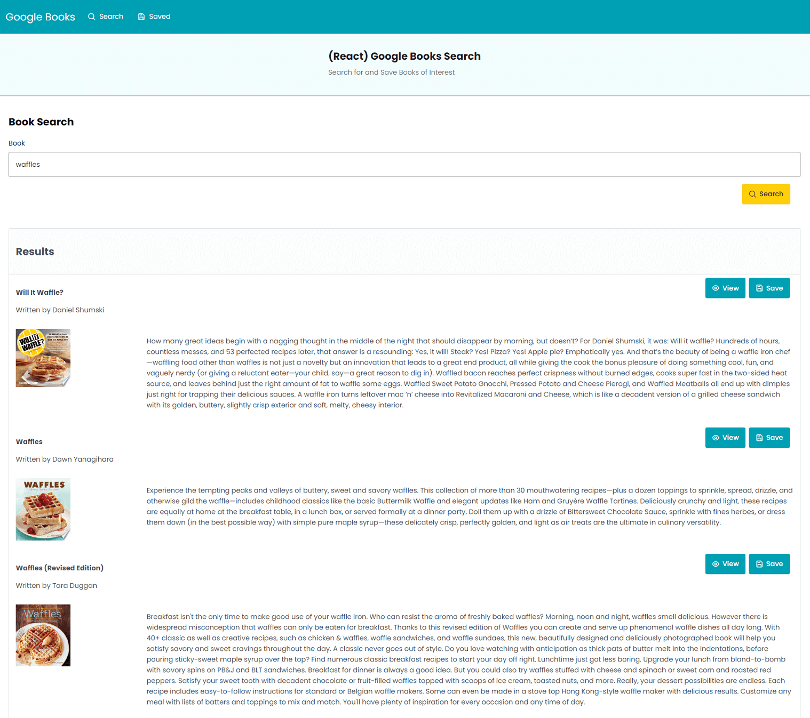
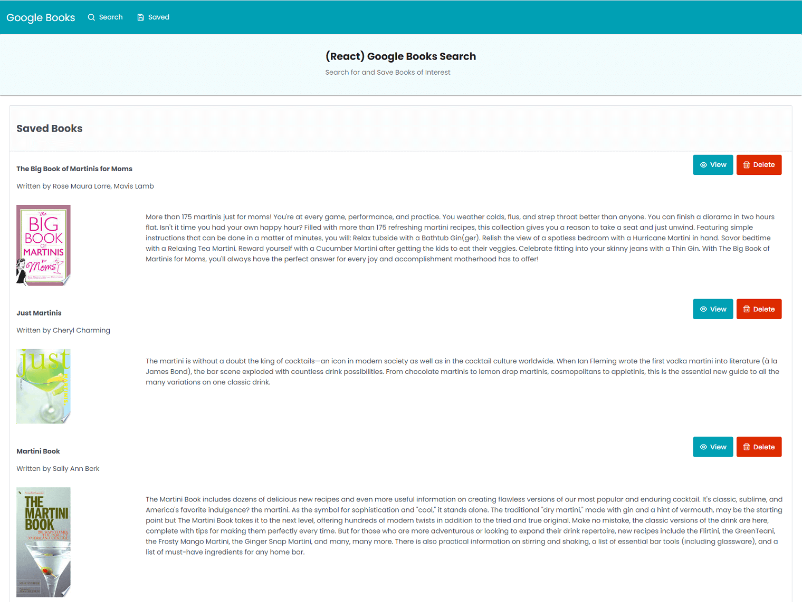

# Google Books Search with React

## Description
Create a React-based Google Books Search app using React components, work with helper/util functions and utilize React lifecycle methods to query and display books based on user searches. Users can save books to review or purchase later.

## Technologies
* React
* [PrimeReact](https://www.primefaces.org/primereact/)

## Screenshot

 
 

